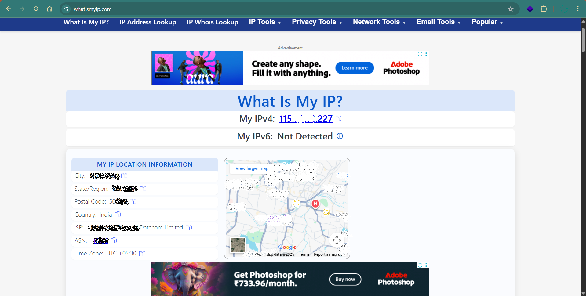
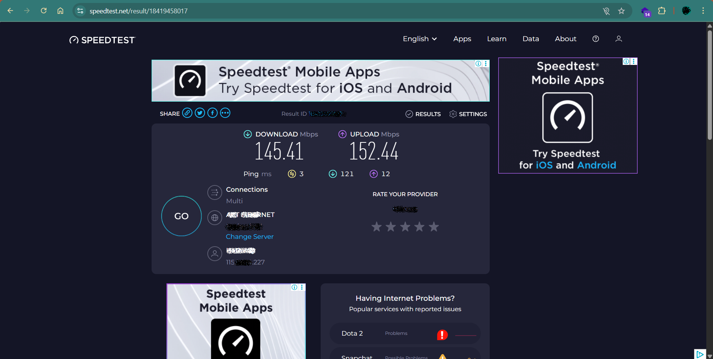
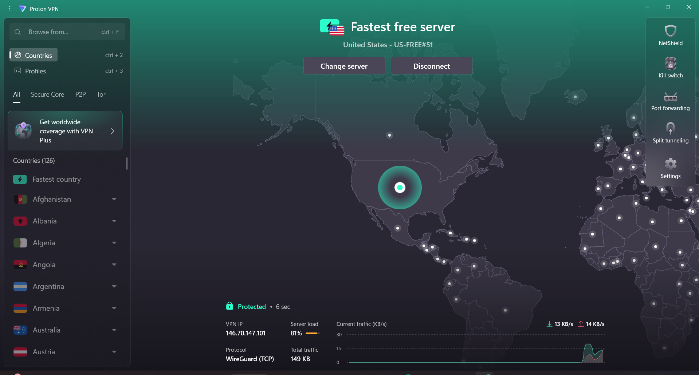
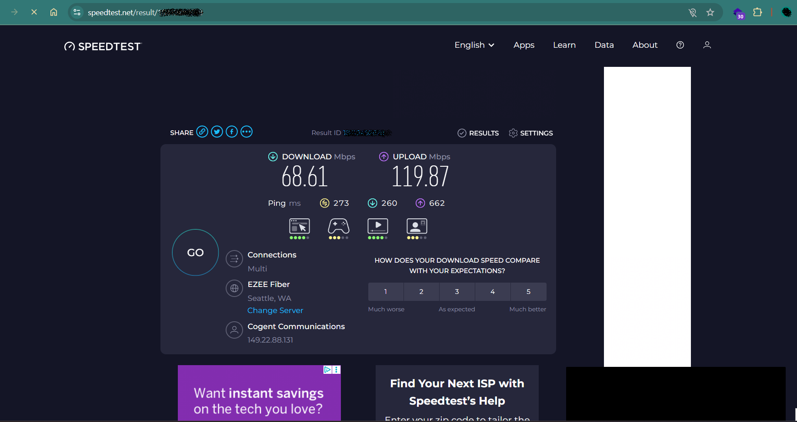

# Elevate-labs-Cybersecurity-Task-08
A repository for the task 08 from the Elevate labs, Cybersecurity

# 🚦 VPN Privacy Lab – Elevate Labs Internship Task 8

Transforming plain old web traffic into encrypted, location-shifting stealth mode—see every defensive move as it happens!

---

## 👁️‍🗨️ Visual Walkthrough: The Screenshot Decoding Canvas

### 1️⃣ Recon: Exposing Your Raw Identity
Before the VPN adventure begins, the browser boldly reveals its true colors:
> 
*See how the world sees you—your real IP, location, and ISP glaring in digital daylight.*

---

### 2️⃣ The Speed Stakes: Unfiltered Performance
Testing my internet's pulse with zero filters:
> 
*Observe the pure download/upload speeds, untethered and fast—yet privacy-vulnerable.*

---

### 3️⃣ Cloak Engaged: VPN On!
Enter ProtonVPN—the dashboard pulses with encrypted life:
> 
*The globe lights up, VPN tunnel snaked across the world. Lock icon signals protection, WireGuard protocol deployed.*

---

### 4️⃣ The Great Disguise: IP Shift in Action
Refreshed my digital signature, this time purposely misleading:
> 
*New IP, mapped far from my location. My real coordinates buried; now surfacing from the USA, not India.*

---

### 5️⃣ Speed Under Cover: The VPN Effect
While anonymity is achieved, performance shifts:
> 
*Speed tested again: throughput dipped, latency tweaked. Privacy has its price, but the connection remains robust inside the encrypted tunnel.*

---

## 🛡️ Security Canvas: What the Evidence Shows

- **Screenshot 1:** Anyone on the web—sites, trackers, ISPs—could map, profile, or sell your raw location information.
- **Screenshot 2:** Speed integrity with no defenses, but leaves you open to surveillance.
- **Screenshot 3:** VPN establishes virtual identity. Encryption shields traffic even on public Wi-Fi.
- **Screenshot 4:** IP successfully masked—geolocation spoofed. Ideal for privacy, bypassing geo-blocks, or avoiding profiling.
- **Screenshot 5:** Tradeoff: a small drop in speed is the cost for privacy armor.

---

## 📋 A Journey in Screens

These aren’t just screenshots—they’re checkpoints on the path from exposed browsing to secure, anonymized access. Every click and scan demonstrates how real-world privacy transforms with a VPN.

---

/screenshots/
├─ origin-ip.jpg # Your public internet face, before

├─ before-vpn.jpg # Speed test: raw net throughput

├─ vpn.jpg # VPN in action, globe lit up

├─ after-vpn.jpg # IP and speed—masked and encrypted

README.md

## 🗂️ Folder Structure

---

##### Every image is a proof node in the chain of digital privacy. This README delivers a full security story—visual, technical, and personal.

